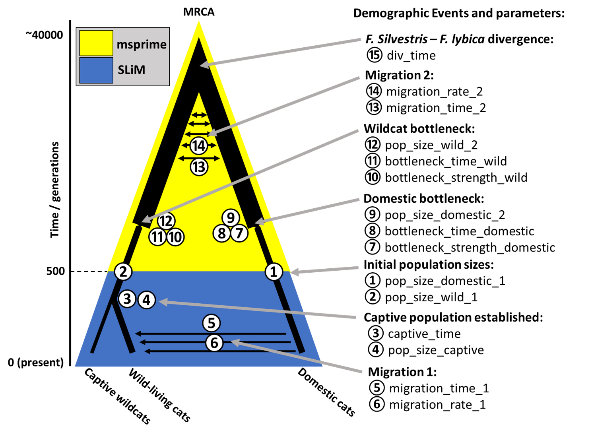

# Model of Wildcat Evolution

### Introduction

Scottish wildcats have undergone extensive hybridisation with domestic cats. This hybridisation has become so extensive that Scottish wildcats are at risk of being "swamped" by the domestic cats, effectively making the Scottish wildcats extinct.

This project involves using Approximate Bayesian Computation to better understand wildcat evolution and hybridisation with the domestic cat. Approximate Bayesian Computation is a likelihood-free method of inference that relies on simulating datasets with parameter values drawn from priors. The distance between the simulated datasets and an observed dataset is used to estimate the posterior distribution of parameter values. Summary statistics are used for these distance comparisons to improve computational efficiency.

### The model of wildcat evolution

The model of I am using, utlises [tree-sequences](https://journals.plos.org/ploscompbiol/article?id=10.1371/journal.pcbi.1006581) to record the genealogies of the simulated populations. The model couples a recent forwards Wright-Fisher model run using [SLiM](http://benhaller.com/slim/SLiM_Manual.pdf) to a coalescent model for the ancient demography run using [msprime](https://msprime.readthedocs.io/en/stable/tutorial.html). Although fast, coalescent simulation can cause [unrealistic pedigree structures](https://www.genetics.org/content/190/4/1433.short), especially during recent events such as admixture. The Wright-Fisher model for the recent hybridisation limits this bias. A schematic of the model is shown below:

The model works as follows:
- Two populations of individuals with empty genomes (no mutations) are established. These can be thought of as an ancestral domestic cat population and an ancestral wildcat population, existing 500 generations (around 1500 years ago). This is precedes extensive hybridisation between the domestic cat wildcats.
- SLiM is then used to run a forwards in time Wright-Fisher model using these individuals, in which extensive hybridisation between the domestic cat and wildcat population occurs and a captive population is established. This generates a "decapitated" tree sequence.
- The Python API msprime is used to 'recapitate' the tree sequence using coalescent simulation. The coalascent model also includes two bottlenecks, corresponding to domestic cat domestication, and wildcat migration to Britain (the founder effect).
- Mutations are then overlaid onto the branches of this now recapitated tree sequence. This tree-sequence can then be used to access the haplotypes of individuals, allowing computation of summary statistics for Approximate Bayesian Computation.
